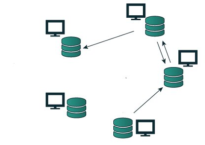
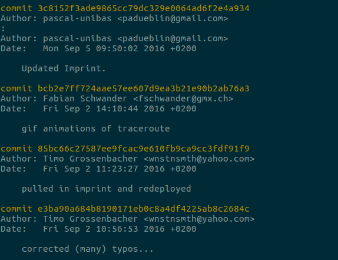
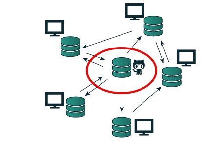

### MAZ-Multimediatag 2016

## Git, GitHub und Co.</h2>

### Was geht mich das an?

Timo Grossenbacher, SRF Data

[@grssnbchr](http://twitter.com/grssnbchr)

[@srfdata](http://twitter.com/srfdata)

timo@timogrossenbacher.ch

Präsentation vefügbar unter [grssnbchr.github.io/mazmmt-git](http://grssnbchr.github.io/mazmmt-git/)

---

### Über mich

Ursprünglich: Studium Geographie & Informatik 

März - Oktober 2014: Tages-Anzeiger

Seit November 2014 beim Team von SRF Data als **Programmierer** und **Datenjournalist** 

[@grssnbchr](http://twitter.com/grssnbchr)

---

### SRF Data

[@srfdata](http://twitter.com/srfdata)

[Portfolio](http://srf.ch/data)

Ein Beispiel: [Nachrichtendienst-Gesetz](http://www.srf.ch/news/schweiz/abstimmungen/abstimmungen/nachrichtendienst-gesetz/bringt-das-neue-nachrichtendienst-gesetz-die-massenueberwachung)

<aside class="notes">Was machen wir? Immer wieder interaktive Applikationen und (programmierte) Datenanalysen - bedingt das Zusammenarbeiten von mehreren Personen am gleichen Projekt / der gleichen Software.</aside>

--- 

### Das Problem

<aside class="notes">Softwareprojekte sind komplex. Meistens arbeiten mehrere Leute daran, ein Journalist bereitet vielleicht die Daten auf, ein Entwickler baut die Applikation dazu und ein Designer oder ein zweiter Entwickler bestimmt über die jeweiligen Farben und Schriftarten. Dazwischen passt ein anderer Journalist laufend Textbausteine an.</aside>

.fragment 1. Wie arbeiten wir in einem Team von 3-5 Leuten effizient zusammen?

.fragment 2. Wie stellen wir sicher, dass wir unsere Daten und unseren Code nicht verlieren?

.fragment 3. Wie können wir unsere Analysen und Daten möglichst einfach veröffentlichen und reproduzierbar machen? 

--- 

### Die Lösung: Versionskontrollsoftware

.fragment Moderne Softwareentwicklung findet in Entwicklungsschritten (Iterationen) statt

.fragment z.B.: Neue Features, Fehler beheben (Bugfixing), neuer Datensatz, usw.

.fragment Jeder Entwicklungsschritt hat einen Autor

.fragment Jeder Entwicklungsschritt kann ein oder mehrere Dateien umfassen

.fragment Keine Angst: Beispiel kommt gleich :-) 

---

### Git 1/2

.fragment Vor rund 10 Jahren von Linus Torvalds, dem Erfinder von Linux, entwickelt

.fragment Es gibt auch andere, z.B. SVN oder Mercurial, aber Git ist die populärste Software

.fragment Free and Open Source - von jedermann auf jedem Rechner gratis installierbar

<aside class="notes">Git gibt es in seiner heutigen Form seit rund 10 Jahren und – wer hätte es gedacht – wurde von Linus Torvalds, dem Erfinder von Linux, höchstpersönlich auf die Welt gesetzt. Er nutzte das System vorderhand, um den immer unübersichtlicher gewordenen Quellcode von Linux besser zu verwalten. Git ist FOSS (Free and Open Source Software) und daher durch jedermann auf jedem Rechner installier- und verwendbar. </aside>

---

### Git 2/2

.fragment Code und Daten sind in Repositories (= Projekten) organisiert

.fragment Entwicklungsschritt == Commit

.fragment Git funktioniert dezentral - jeder Autor hat eine Kopie des Repo

.fragment Autoren synchronisieren sich gegenseitig (über einen Server wie GitHub - mehr dazu gleich)

.fragment 

.fragment <small>Angepasst von: http://thepilcrow.net/explaining-basic-concepts-git-and-github/</small>

---

### Demo: NDG

---

### Weitere Vorteile

.fragment Man kann jederzeit von jedem Rechner auf den aktuellen Stand eines Projekts zurückgreifen

.fragment Es lässt sich auch anderes als Code versionieren, z.B. Datenbanken oder binäre Dateien (Videos, Bilder)

--- 

### Was ist GitHub? 

.fragment GitHub ist ein **Server** für Git

.fragment 

.fragment <small>Angepasst von: http://thepilcrow.net/explaining-basic-concepts-git-and-github/</small>

.fragment GitHub vereinfacht den Austausch zwischen Autoren eines Repositories - man muss keinen eigenen Server aufsetzen

.fragment Weiteres: Zugriffsberechtigungen, Koordination von Open-Source-Projekten, Bugtracker, usw.

--- 

### GitHub und Open Source

.fragment These: Ohne GitHub wäre Open Source heute nicht so populär

.fragment [srfdata.github.io](https://srfdata.github.io)

.fragment Aber: Auch das Verwalten von privaten Repositories ist möglich

--- 

### Exkurs: Branching

.fragment Repositories können in "Zweige" (Branches) aufgeteilt werden

.fragment Verschiedene Autoren arbeiten an unterschiedlichen Zweigen, die (allenfalls) wieder zusammenwachsen (gemerged werden)

.fragment Das "Zusammenwachsen" einer Datei verläuft i.d.R. reibungslos, wenn sie an unterschiedlichen Orten (Zeilen) geändert wurde

<small>Quelle: http://rogerdudler.github.io/git-guide/index.de.html</small>

--- 

### Demo: Branching

Beispiel: Ein Hauptzweig ("master") und verschiedene Zweige für stilistische Variationen

---

### Nachteile / Caveats

.fragment Bedingt gewisses IT-Verständnis und Bereitschaft, sich in Git zu vertiefen

.fragment Bedingt regelmässige Anwendung

.fragment Empfohlene Systemumgebung: UNIX (Mac, Linux)

.fragment Vorsicht beim Hosten von sensiblen Datensätzen! 

---

### Wie weiter - meine Empfehlung

.fragment Mal bei Entwicklern im Haus nachfragen, welche Versionskontrollsoftware sie einsetzen - und wie 

.fragment Tutorials und Manuals studieren (1-3 Tage)

.fragment Entwicklung einer Applikation "im Code" begleiten und sich von Entwicklern unterstützen lassen

---

## Links

[Offizielles Git-Handbuch (Kapitel 1-4)]( https://git-scm.com/book/de/v1) 

[Explaining the basic concepts of git and how to use github](http://thepilcrow.net/explaining-basic-concepts-git-and-github/)

[Handout](https://github.com/grssnbchr/mazmmt-git/blob/gh-pages/Handout_Multimediatag_Grossenbacher.pdf)

---

# Danke

## Fragen? 

[@grssnbchr](http://twitter.com/grssnbchr)

[@srfdata](http://twitter.com/srfdata)

timo@timogrossenbacher.ch

Diese Präsentation ist verfügbar (und reproduzierbar) unter [github.com/grssnbchr/mazmmt-git](https://github.com/grssnbchr/mazmmt-git/blob/gh-pages/index.md)

<small>Gebaut mit [slidify](https://github.com/ramnathv/slidify) und [revealjs](https://github.com/hakimel/reveal.js/)</small>
